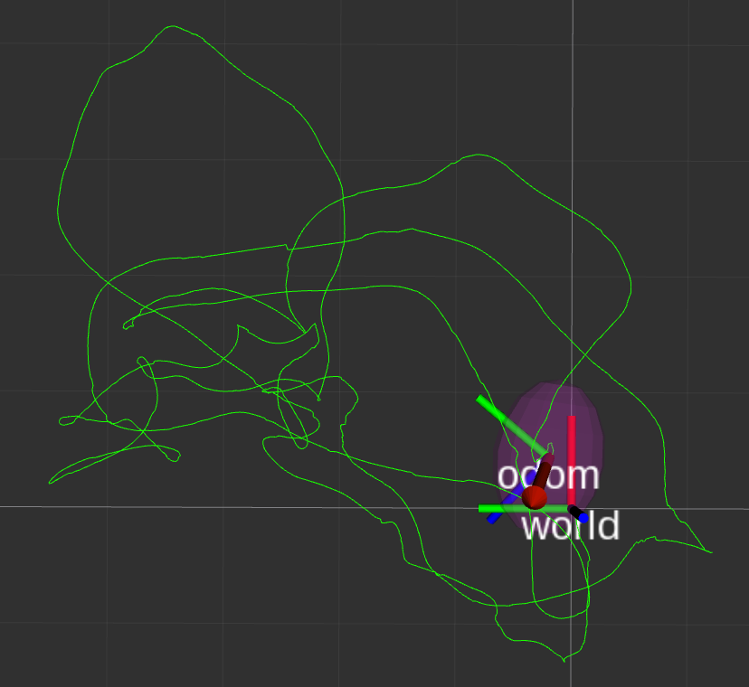
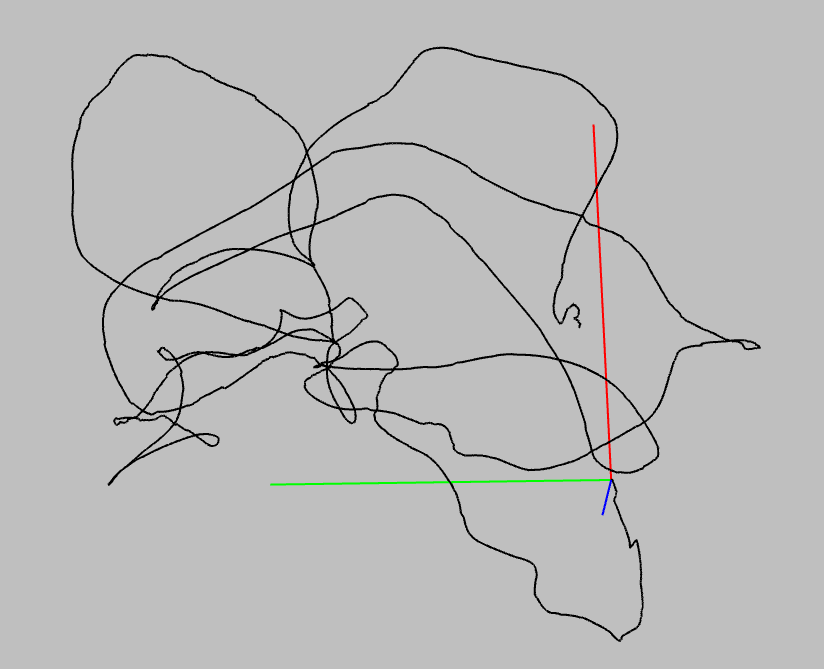
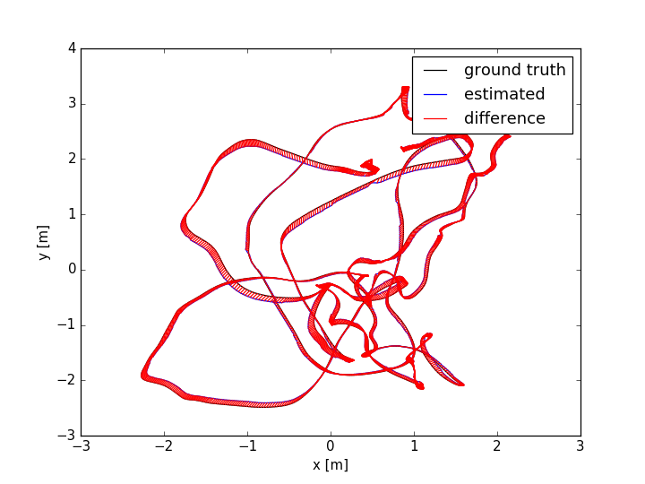
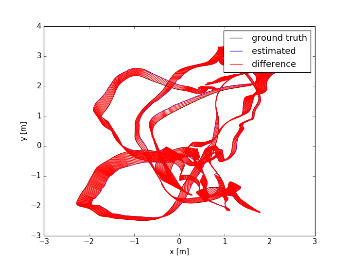
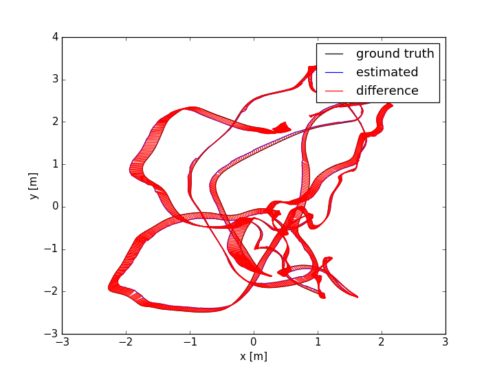

# msckf_vio_mynt

modified version of msckf_vio

-----

## Build

```sh
mkdir build
cd build
cmake ..
make -j3
```

## Run

* main project
  ```sh
  cd build
  ./run_euroc
  ```

* unit test
  ```sh
  cd build
  ./test/run_unit_test
  ```

## Test Dataset

Remember change the value of variable `std::string euroc_dir` defined in **run_euroc.cpp**.

* [The EuRoC MAV Dataset](https://projects.asl.ethz.ch/datasets/doku.php?id=kmavvisualinertialdatasets)
  - [V1_01_easy.zip](http://robotics.ethz.ch/~asl-datasets/ijrr_euroc_mav_dataset/vicon_room1/V1_01_easy/V1_01_easy.zip)

## Results

result for running with V1_01_easy dataset

* original msckf_vio
  

* our msckf_vio
  

### Evaluation

evaluate the SLAM/tracking results **pose_out.txt** with the groundtruth of V1_01_easy dataset using **rgbd_benchmark_tools** of TUM

* original msckf_vio
  ```sh
  absolute_translational_error.rmse 0.071404 m
  absolute_translational_error.mean 0.067402 m
  absolute_translational_error.median 0.067896 m
  absolute_translational_error.std 0.023568 m
  absolute_translational_error.min 0.004329 m
  absolute_translational_error.max 0.142763 m
  ```
  

* our msckf_vio 01
  ```sh
  absolute_translational_error.rmse 0.264028 m
  absolute_translational_error.mean 0.241694 m
  absolute_translational_error.median 0.222784 m
  absolute_translational_error.std 0.106277 m
  absolute_translational_error.min 0.028613 m
  absolute_translational_error.max 0.490709 m
  ```
  

* our msckf_vio 02
  ```sh
  absolute_translational_error.rmse 0.120664 m
  absolute_translational_error.mean 0.108885 m
  absolute_translational_error.median 0.097097 m
  absolute_translational_error.std 0.052000 m
  absolute_translational_error.min 0.017028 m
  absolute_translational_error.max 0.243474 m
  ```
  

## TODO

- [x] 编写EuRoC数据接口：Image和IMU两线程结构
- [x] 编写YAML配置文件读写接口
- [x] 添加单元测试
- [x] 添加 ImageProcessor
  - [x] 将 ROS message 改为 C++结构体
  - [x] 修改其他ROS数据结构为Plain C++数据结构
  - [x] 测试、调试（1 Day）
- [x] 添加 msckf_vio
  - [x] 将ROS数据结构为Plain C++数据结构（1 Day）
  - [x] 测试、调试（1 Day）
- [x] 添加 Draw 线程：轨迹渲染显示（1 Day）
- [ ] 系统测试、调试（1-2 Day）
- [ ] 代码重构（1 Day）
- [ ] 第三方库替换
  - [ ] PCL（1 Day）
  - [ ] OpenCV（1-2 Day）
  - [ ] Eigen3（1-2 Day）
  - [ ] 测试、调试（1-2 Day）
- [ ] 功能优化
- [ ] C代码重构
- [ ] FPGA移植
